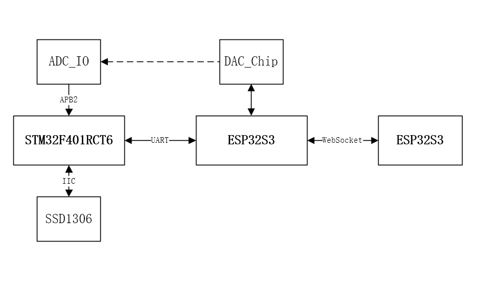
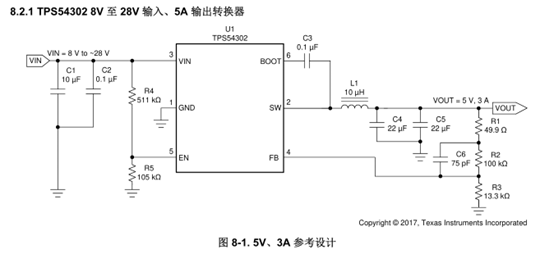

# 26晚23点

触发对话

# 27凌晨开始计时，一周

选用STM32F401RCT6和ESP32S3、但是手头没有现成的，快递时间不够，F4只有一个ADC通道，也许是楹蓝特意为之？
系统框图如下：

DCDC部分，以前使用到的方案全部是来自USB的供电过LDO，未曾使用该方案；查找数据手册抄过来了典型应用电路，我想一切从简，直接从DC输出3.3，VDD和Verf+都采用同一路，手册中Vout = 5V,需要修改下配置电阻

以图中位号，最后修改为：

| 位号  | Value_Raw | Vlaue_now |
| --- | --------- | --------- |
| R1  |           |           |
| R3  |           |           |
| C6  |           |           |
